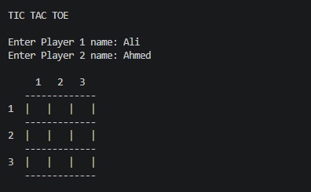
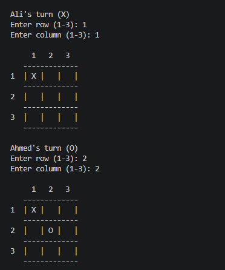
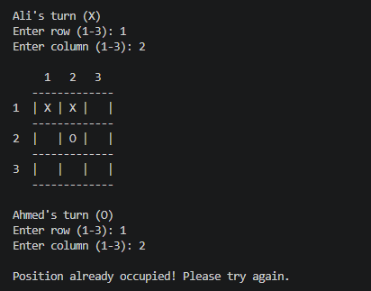
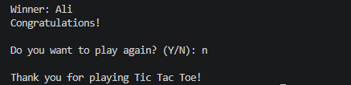

## 🎮 Tic Tac Toe

## 📌 Project Overview

Tic Tac Toe is a C++ console-based two-player game where two players take turns placing their symbols, X and O, on a 3×3 game board. The game checks the board after each move and declares a winner when a player successfully places three matching symbols in a row, column, or diagonal.

The project is developed using Object-Oriented Programming (OOP) concepts and basic C++ programming techniques.

## 📸 Screenshots

<table>
   <tr>
    <td align="center"><b>Game Start</b> </td>
    <td align="center"><b>Game Play</b> </td>
  </tr>
   <tr>
    <td align="center"><b>Invalid Move</b> </td>
    <td align="center"><b>Game Result</b> </td>
  </tr>
</table>

## 🎮 Features

* Enter names for two players
*  3×3 game board
*  Player 1 uses X
*  Player 2 uses O
*  Turn-based gameplay
*  Row and column input
*  Checks for occupied positions
*  Winner detection
*  Play again option
*  Displays final game result

## 🛠️ Technologies Used

* C++
* Object-Oriented Programming

## 👩‍💻 Author

Laiba Fatima